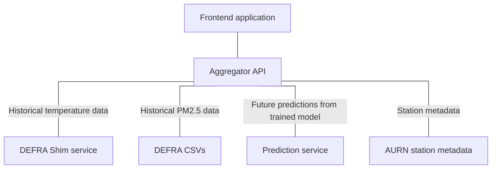

# COMP3000 Project - Predictions

## What is this?

This repository contains the Jupyter notebooks and deployment infrastructure/scripts used in the COMP3000 project to predict future air quality and temperature.

## Navigation

- [Frontend](https://github.com/Lewis-Trowbridge/COMP3000-Project-Frontend)
- [Aggregator](https://github.com/Lewis-Trowbridge/COMP3000-Project-Backend-API)
- Predictions (you are here)
- [Metadata](https://github.com/Lewis-Trowbridge/COMP3000-DEFRA-To-Mongo)
- [Shim](https://github.com/Lewis-Trowbridge/COMP3000-Project-DEFRA-Shim)

## How is it made?

This service uses Jupyter Notebooks and Tensorflow to produce machine learning models based on pyaurn data. These models are hosted in OneDrive, where they are pulled and unpacked in the Dockerfile which builds on Tensorflow Serving.

## How do I use it?

Training can be performed by installing Tensorflow and running the notebooks as any other.

Hosting can be performed by building the dockerfile, which will pull the current models from OneDrive.
